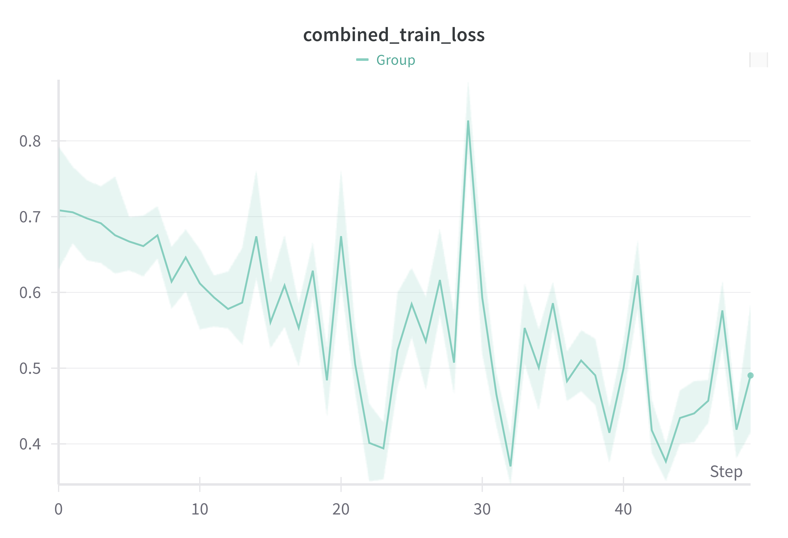

# Applied Deep Learning: Project Proposal

Insert
[TOC]

## Setup & Installation

- Prerequisites:
    - Python 3.8 or higher
    - CUDA-compatible GPU (recommended) or CPU
    - 8GB RAM minimum
- Installation
    - Clone Repository
    - Create and activate environment
    - Install dependencies with `pip install -r requirements.txt`
    - WandB Setup Up (once) and login (enter API Key)
    - Run different scripts from the `scripts` folder in the terminal, e.g. `python scripts/debugging/train_debug.py`

## Project Overview

In this project, I aim to tackle the challenge of media bias detection, particularly in an age where information
overload and cognitive biases make it increasingly difficult for individuals to critically analyze the media they
consume.
Drawing on established research in automated bias detection, I plan to build a model that helps identify
potential biases in news articles, primarily as a reminder to remain critical without replacing personal judgment.

## Idea and Approach

The project will be a mix of *Bring Your Own Method* and *Bring Your Own Data*. Existing models, such as MAGPIE
(Horych et al., 2024) and earlier works like form Spinde et al. (2022), have already made significant advancements in
automated media bias detection with deep learning models, particularly for English-language data.
My approach involves adapting these models by simplifying the architecture to make it computationally more feasible
while trying to preserve accuracy.

Key modifications include:

- Replacing MAGPIE’s pre-trained model encoder RoBERTa with DistilBERT, which is more efficient and suitable for the
  available computational resources.
- Simplifying and redesigning MAGPIE’s architecture, leveraging the foundational work of Spinde et al. (2022), whose
  model uses a simpler framework.
- Reducing the number of datasets and tasks in the multitask learning setup to decrease the computational load.

To present my work, I aim to build a simple interface where users can input text and receive bias detection results.
Menzner & Leidner (2024) developed a similar interface using GPT-3.5. However, I will implement the architecture
described above for a more targeted and resource-efficient bias detection solution.

## The Datasets

As mentioned above, in order for the project to be feasible, I will need to simplify the data for the multitask learning
setup.
Therefore, I will use the following datasets from the MAGPIE paper, being the smallest datasets in each task family,
except for the News bias task family:

| Task Family        | Dataset                                 | # sentences | Task                       |
|--------------------|-----------------------------------------|-------------|----------------------------|
| Subjective bias    | CW_HARD (Hube and Fetahu, 2019)         | 6.843       | Regression                 |
| News bias          | BABE (Spinde et al., 2021c)             | 3,672       | Binary Classification      |
| Hate speech        | MeTooMA (Gautam et al., 2020)           | 7,388       | Binary Classification      |
| Gender bias        | GAP (Webster et al., 2018)              | 4,373       | Binary Classification      |
| Sentiment analysis | MDGender (Din et al., 2020)             | 2,332       | Binary Classification      |
| Fake news          | MPQA (Wilson, 2008)                     | 5,508       | Token-Level Classification |
| Emotionally        | GoodNewsEveryone (Bostan et al., 2020)  | 4,428       | Token-Level Classification |
| Group bias         | StereotypeDataset (Pujari et al., 2022) | 2,208       | Binary Classification      |
| Stance detection   | GWSD (Luo et al., 2020)                 | 2,010       | Multi-Class Classification |

The datasets are available in the MAGPIE repository, and I will use the same data preprocessing steps as in the original
paper.

However, the final choice of datasets is subject to change based on the computational resources available and the
model's performance during the hacking phase of the project.

## Initial Work Breakdown Structure

The following table outlines the tasks and their respective time estimates and due dates for the project:

| Task                                           | Time Estimate (hrs) | Due Date |
|------------------------------------------------|---------------------|----------|
| Dataset Collection                             | 2                   | 24.10.24 |
| Designing and Building an Appropriate Network  | 15-20               | 17.11.24 |
| Training and Fine-tuning that Network          | 20-25               | 17.12.24 |
| Building an Application to Present the Results | 15-20               | 05.01.25 |
| Writing the Final Report                       | 10                  | 19.01.25 |
| Preparing the Presentation of Your Work        | 5-10                | 28.01.25 |

## References

1. Horych, T., Wessel, M., Wahle, J. P., Ruas, T., Waßmuth, J., Greiner-Petter, A., Aizawa, A., Gipp, B., & Spinde, T. (
   2024).
   **Magpie: Multi-task media-bias analysis generalization for pre-trained identification of expressions.**
   [Link to the paper](https://arxiv.org/abs/2403.07910),
   [Link to the Github implementation](https://github.com/Media-Bias-Group/magpie-multi-task)

2. Menzner, T., & Leidner, J. L. (2024). BiasScanner: Automatic detection and classification of news bias to strengthen
   democracy. arXiv.
   [Link to the paper](https://arxiv.org/abs/2407.10829),
   [Link to the implementation web page](https://biasscanner.org/#links)

3. Rodrigo-Ginés, F.-J., Carrillo-de-Albornoz, J., & Plaza, L. (2024). **A systematic review on media bias detection:
   What is media bias, how it is expressed,
   and how to detect it.** Expert Systems with Applications, 237, 121641.
   [Link to the paper](https://doi.org/10.1016/j.eswa.2023.121641)

4. Spinde, T., Hinterreiter, S., Haak, F., Ruas, T., Giese, H., Meuschke, N., & Gipp, B. (2024). **The media bias
   taxonomy:
   A systematic literature review on the forms and automated detection of media bias.**
   [Link to the paper](https://arxiv.org/abs/2312.16148)

5. Spinde, T., Krieger, J.-D., Ruas, T., Mitrovi´c, J., G¨otz-Hahn, F., Aizawa, A., & Gipp, B. (2022). **Exploiting
   transformer-based multitask learning
   for the detection of media bias in news articles.** In Information for a better world: Shaping the global future (pp.
   225–235). Springer International Publishing.
   [Link to the paper](https://arxiv.org/abs/2211.03491),
   [Link to the Github implementation](https://github.com/Media-Bias-Group/Exploiting-Transformer-based-Multitask-Learning-for-the-Detection-of-Media-Bias-in-News-Articles)

----------------------------------------------------------------------------------------------------------------

# Hacking Phase Documentation

## Brief Summary

Please also provide a brief summary (e.g., in your README) of

- the error metric you specified
- the target of that error metric that you want to achieve
- the actually achieved value of that metric
- the amount of time you spent on each task, according to your own work breakdown structure.

## Time Tracking

1. **Initial Setup** (9h)
    - Environment setup and MLFlow configuration with MLOps tutorial (6h)
    - Code understanding and repository analysis (3h)


2. **First Implementation Attempt** (30h)
    - Data pipeline development (4h)
    - Baseline model notebook (16h)
    - Code modularization (10h)


3. **Project Reset and Main Implementation** (29h)
    - New architecture setup (13h)
    - Training pipeline debugging (11h)
    - Baseline model training (4h)
    - Hyperparameter optimization setup (6h)


4. **Running Experiments** (~32h compute time)
    - Pre-finetuning run for baseline (8h)
    - Finetuning across 30 seeds for baseline (12h)
    - Hyperparameter optimization (XXh)

## Target Metric Specification

The error metric for this project is the (Macro) F1 score, which is the harmonic mean of precision and recall.
It is chosen, because it is suited for the classification problem at hand and also used in the MAGPIE paper,
which is the basis for this project.

The target for my project however is not the one achieved by MAGPIE, since I chose a simpler setup.
Therefore, the target I take is the one from the other MTL Approach by Spinde et al. (2022),
which is a Macro F1 score of 0.78 for the MTL Model.

Spinde et al. (2022):


MAGPIE (2024):


## Final Model Architecture

The final model architecture is a simplified version of the MAGPIE model, using DistilBERT as the backbone and a
multitask learning setup with 9 datasets containing 11 Subtasks. The model consists of the following components:

- **Data processing and handling**: _describe how it works_
- **Model architecture components**: _describe how it works_
  DistilBERT Backbone (backbone.py)

  Shared encoder that processes text inputs into contextual embeddings
  Pre-trained model that's fine-tuned during training
  Takes tokenized text and outputs hidden states of dimension 768
  Task-Specific Heads (heads.py)

  Different types of classification heads:

  ClassificationHead: Binary/multiclass classification
  TokenClassificationHead: Token-level predictions
  MultiLabelClassificationHead: Multiple label prediction

  Each head contains:

  Dense layers for task-specific transformations
  Task-specific loss functions
  Metric tracking (F1 score, accuracy)

  Gradient Management (gradient.py)

  Handles potential conflicts between different tasks during training
  Implements different gradient aggregation methods:

  Mean: Simple averaging of gradients
  PCGrad: Projects conflicting gradients
  PCGrad-Online: Online version of gradient projection
- **Training components**: _describe how it works_

  Trainer Components (trainer.py)
  Manages two optimization loops:
  Backbone optimization with shared parameters
  Head-specific optimization for each task

  Implements early stopping with:
  Task-specific patience
  "Zombie" resurrection system (tasks can be revived)

  Batch handling:
  Processes batches from different tasks
  Accumulates gradients appropriately
  Applies loss scaling
- **Source-specific utilities**: _describe how it works_

## Repository Structure

```
project_root/
│
├── src/                               # Core source code
│   │
│   ├── data/                         # Data processing and handling
│   │   ├── __init__.py               # Initialization of all data tasks
│   │   ├── task.py                   # Task and Subtask classes 
│   │   ├── dataset.py                # Dataset classes for data loading, preprocessing
│   │
│   ├── model/                        # Model architecture components
│   │   ├── model.py                  # Main MTL model combining backbone and heads
│   │   ├── heads.py                  # Task-specific model heads for different subtasks
│   │   ├── backbone.py               # Shared DistilBERT backbone
│   │   └── gradient.py               # Gradient management for MTL
│   │
│   ├── training/                     # Training components
│   │   ├── trainer.py                # Main training loop and logic
│   │   ├── checkpoint.py             # Model checkpointing
│   │   ├── logger.py                 # Training logging to wandb
│   │   ├── metrics.py                # Metrics tracking and computation
│   │   └── training_utils.py         # Training helper functions
│   │
│   ├── tokenizer.py                  # Tokenizer initialization
│   └── utils/                        # Source-specific utilities
│       ├── common.py                 # Common helper functions
│       ├── enums.py                  # Enumerations for model settings
│       └── logger.py                 # Global logging setup       
│
├── research/                         # Research and experiments
│   ├── magpie_repo_test.ipynb        # Testing notebook for model components with MAGPIE structure
│   └── updated_code_test.ipynb       # Testing notebook for updated model components
│
└── scripts/                          # Scripts for running experiments
    │
    ├── debugging/                    # Debugging scripts for testing the pipeline
    │   ├── train_debug.py            # Debugging script for single step
    │   └── full_train_debug.py       # Debugging script for several training steps
    │
    ├── training_baseline/
    │   ├── pre_finetune.py           # Pre-finetuning script for baseline model
    │   └── finetune.py               # Finetuning script for baseline model for 30 seeds
    │   
    └── hyperparameter_tuning/        # Hyperparameter optimization scripts
        ├──train_prefinetuning_v2.py  # Script for pre-finetuning with more steps
        └── hyperparameter_tuning.py  # Main script for hyperparameter optimization for finetuning
   
```

- Datasets file und logging noch hinzufügen
- datasets auch für git
-
-

## Training and Evaluation

The process of training the model is as follows:

1. Data Initialization (preprocessed from repository)

1. Train a baseline model with the hyperparameter setting of the MAGPIE paper:
    - pre-finetune the DistilBERT Model on all datasets except for the BABE dataset
    - finetune the model on the BABE dataset and compare over 30 random seeds

2. Perform hyperparameter tuning to find the optimal hyperparameters for the model
   (see next chapter for detail)

Description of the different scripts.

## Results

All training steps were done on my computer (MacBook Air M2, 16GB RAM, 8 cores)
and the results were tracked with wandb.

### Baseline Model

#### Pre Finetuning Results (plots from wandb):


- 100 steps for pre-finetuning, should be increased, loss is still "moving around" quite a lot
- Some tasks perform very bad, with F1 Scores under 0.5:
    - MeTooMA (108, F1 <0.1)
    - MDGender (116, F1 <0.35)
    - Stereotype (109 subtask 2, F1 <0.45)

#### Finetuning with Babe (over 30 seeds, plots from wandb):)

Mean Test F1: 68,77%
Max Test F1: 71,43%



- 50 steps for finetuning, should be increased, loss is still "moving around" quite a lot

### Hyperparameter Tuning

Since in the MAGPIE repository, they already did a hyperparameter tuning for the subtasks for:

- Learning rate
- Max epochs and
- Early stopping patience,

I will use the hyperparameters from the MAGPIE paper for both, pre-finetuning and finetuning
and increase the number of max_steps to 500 in comparison to my baseline,
as well as the warmup steps to 10% of the max_steps for the pre-finetuning.

For the finetuning step, I will do a hyperparameter optimization with a grid search
for the following parameters:

- Dropout rate for regularization
- Batch size variations
- Warmup steps for learning rate scheduler

Results for Subtask 1:


Results for Subtask 2:


- Best configuartion: dropout_rate: 0.1, batch_size: 64 for 01, 32 for 02, warmup_steps: 100 (for 500 steps)

### Final Model Results

...

## Open Issues

- Did not build a proper CI pipeline (only manual testing)
- Config File for hyperparameters etc. not in a good format and should be in a different place

## ToDo's

- [x] Add the hyerparameter optimization results
- [ ] Train final model and add results
- [ ] Complete the documentation, especially model architecture and training process
- [ ] Build Inference Pipeline
- [ ] Build interface for model
- [ ] Write final report


